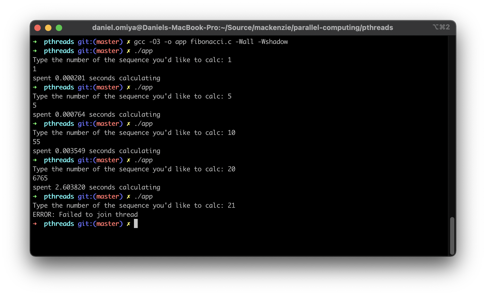
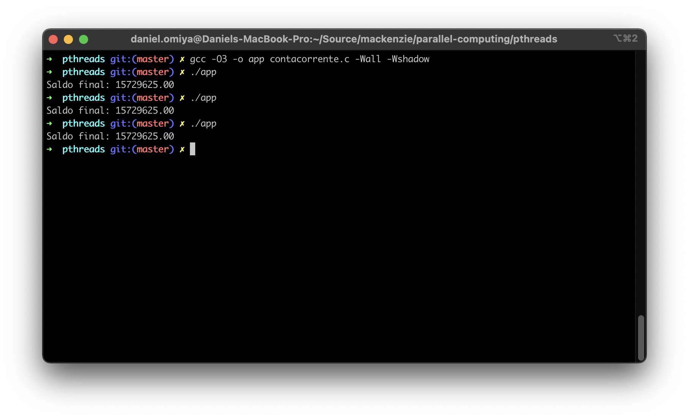
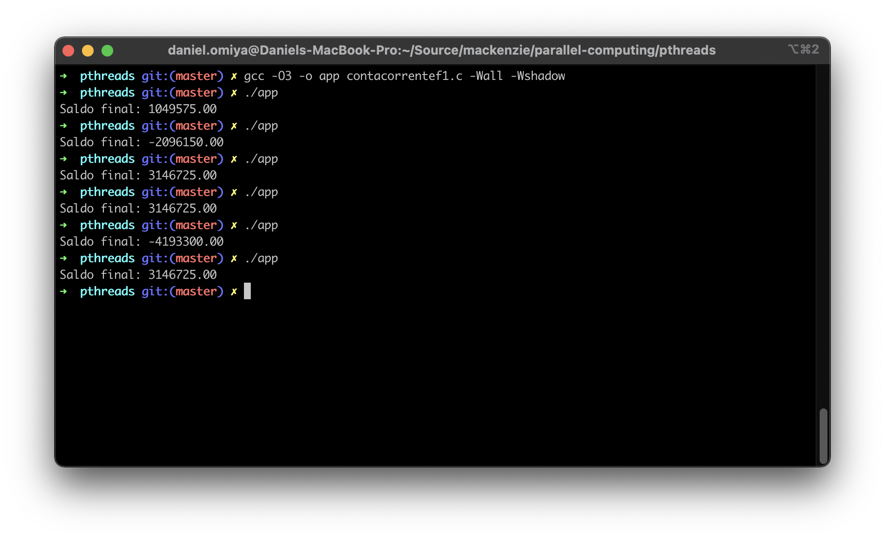
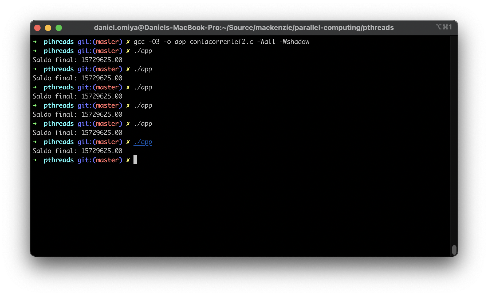
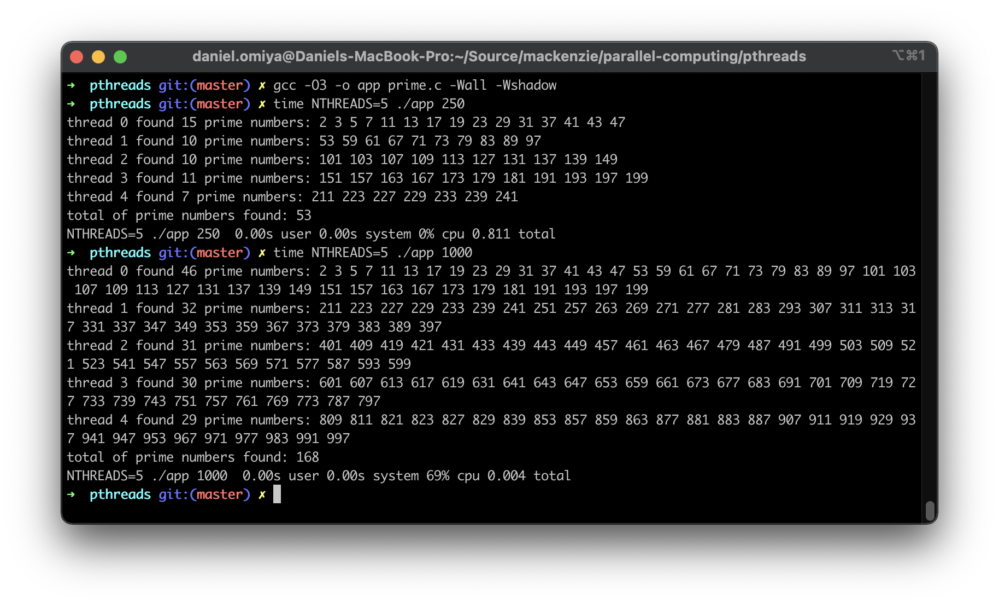

# Relatório

## Fibonacci

> O que acontece se, de alguma forma, fossem calculados os termos dessa soma de forma paralela?

O algoritmo apresentaria performance bastante degradada em relação a um algoritmo serial otimizado, pois as tarefas que são calculadas em paralelo têm forte dependência umas das outras. Além disso, possui um limite muito baixo de termos que é capaz de calcular (no caso da _print_ abaixo, o limite foi `20`), devido à quantidade de _threads_ que um processo é capaz de criar.

## Conta corrente

### Fase 0

### Fase 1

### Fase 2

## Números primos

